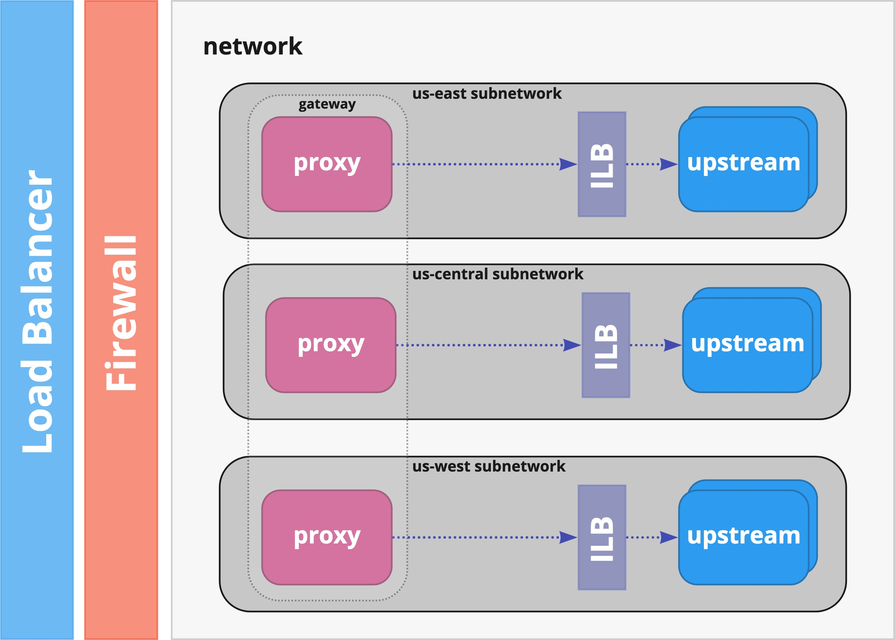

# Power of IaC with Terraform



## Pre-requisites

This demo leverages the following set of tools.  Links have been provided for instructions on installation.

1. [Terraform](https://www.terraform.io/downloads.html)
2. [jq](https://stedolan.github.io/jq/download/)
3. [gcloud](https://cloud.google.com/sdk/docs/quickstart)
4. [curl](https://curl.se)

We are leveraging [Google Cloud Platform](https://cloud.google.com/free/) to deploy our infrastructure resources.  You'll need to have access to a Google Cloud Platform project in order to complete the exercise.

### Configure credentials

In order to authorize Terraform to make changes in our Google Cloud project, we'll need to configure credentials for it.  We can do this by either using a [service account](https://cloud.google.com/docs/authentication/production#manually) or using by using [Application Default Credentials](https://cloud.google.com/sdk/gcloud/reference/auth/application-default) via the `gcloud` CLI.  For this demo, we'll use application default credentials to keep things simple.

For details on how to authenticate using `Application Default Credentials`, visit [https://cloud.google.com/sdk/gcloud/reference/auth/application-default](https://cloud.google.com/sdk/gcloud/reference/auth/application-default)

## Running the build

### 1) Inititalize Terraform Provider/Modules

First, we need to initialize the provider, in this case the [Hashicorp Google Provider](https://registry.terraform.io/providers/hashicorp/google/latest/docs) as well as our modules.
> Note: we change into the `environments/gateway` folder.  All following commands will be executed from this context.  If you don't do this, you'll need to pass in the path to the folder containing the terraform templates to be executed.
```
cd environments/gateway
terraform init
```

### 2) Set Google Project ID for Provider
In order to set our target Google Cloud project, we'll configure an environment variable to set the `project` Terraform variable that we define in `environments/gateway/variables.tf`.  You may also set this variable via the command line as well; otherwise, Terraform will prompt for a value prior to executing any command. 

> Note: You'll want to replace `[MY GOOGLE PROJECT ID]` with the ID of your Google project.

```
export TF_VAR_project=[MY GOOGLE PROJECT ID]
```

### 3) Generate Plan
Next, we'll execute `terraform plan` to generate a list of all resources Terraform will attempt to create based on the resource definitions defined within our Terraform modules.

```
terraform plan
```

### 4) Apply Changes

Next, we we'll apply the changes.  This will instruct Terraform to create our resources.

> Note: You may choose to automatically accept the changes that Terraform plans to make by including the `-auto-approve` flag in your `apply` command.  This will instruct Terraform to not prompt for your approval.  Otherwise, you'll need to accept the planned changes when prompted before Terraform begins our build.

> !! Please note that the `apply` step make take a few minutes to complete.  In our testing, it took ~4-5 mins to complete.

```
terraform apply
```

### 5) Test

In the following code snippet, we'll retrieve the external load balancer's IP from output `load_balancer` Terraform variable and use it to make an HTTP request (using cURL) to our upstream service through the newly built API Gateway.  

> Note: It can take 5-10 minutes for the Load Balancer to come up.  Until that happens, you may receive a 4XX/5XX status code reply.  In our example below, we continously call our gateway's IP in a loop every 10 secs.

```
LB_IP=`terraform output -json | jq -r .load_balancer.value`
while true; do curl -H "Host: echo.service.internal" http://${LB_IP}; printf "\n\n"; sleep 10; done
```

### 6) Clean Up

The following command will tear down all resources created/managed in Terraform's state.

> Note: You may choose to automatically accept the changes that Terraform plans to make by including the `-auto-approve` flag in your `apply` command.  This will instruct Terraform to not prompt for your approval.  Otherwise, you'll need to accept the planned changes when prompted before Terraform begins our build.

> !! This step may take some time to complete.  In our testing, it took upwards of 10 mins.
```
terraform destroy
```